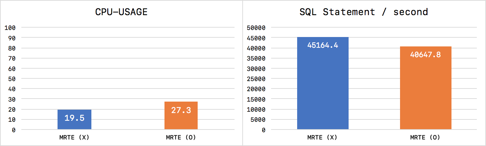
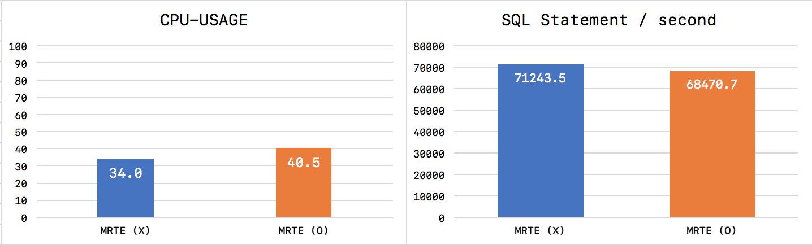
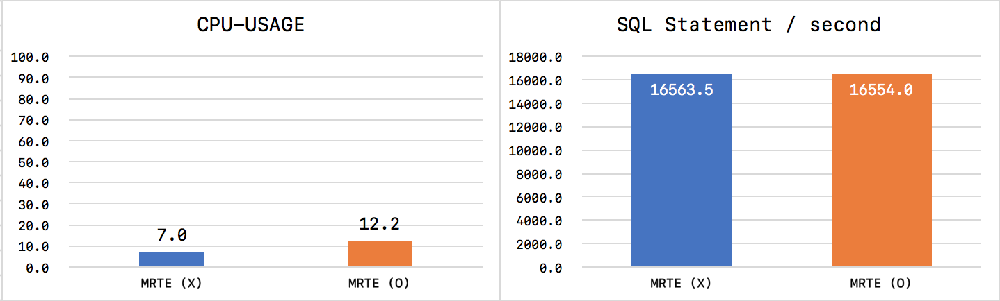
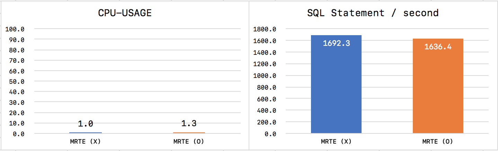
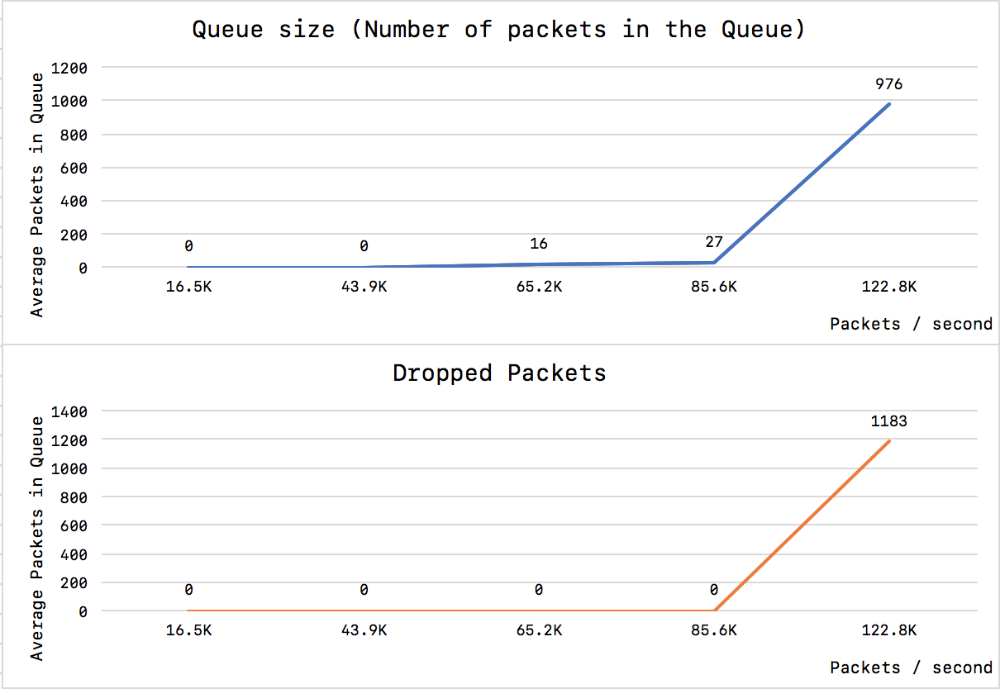

### MRTECollector Performance
MRTECollector는 서비스 환경의 MySQL 서버가 작동하는 서버에서 실행되어야 하기 때문에 성능이나 시스템에 미치는 영향이 어느정도인지가 매우 중요하다고 볼 수 있다. 그래서 MySQL 서버로 많은 패킷이 유입되는 상황에서 MRTECollector가 어떻게 반응하는지 그리고 얼마나 많은 시스템 자원을 소모하는지 한번 확인해보았다.

이 테스트에서 MySQL 서버의 트래픽을 유발하기 위해서 아래와 같은 옵션으로 mysqlslap 명령을 활용하였다.
```bash
# mysqlslap \
  --host=source-mysql-db \
  --port=3306 
  --user=mrte2 --password=mrte2 \
  --delimiter=";" \
  --concurrency=N --number-of-queries=100000000 --iterations=1 \
  --query="set @id=floor(rand()*5000000);select value from mysqlslap.mysqlslap where id=@id;"
```

##### mysqlslap에서 16개 쓰레드로 sleep 없이 SELECT 쿼리 테스트


##### mysqlslap에서 32개 쓰레드로 sleep 없이 SELECT 쿼리 테스트


##### mysqlslap에서 1000개의 쓰레드로 20ms sleep과 함계 SELECT 쿼리 테스트


##### mysqlslap에서 1000개의 쓰레드로 200ms sleep과 함계 SELECT 쿼리 테스트


##### MRTE2의 처리 용량 한계 (Queue와 PacketDropped 개수 확인)

